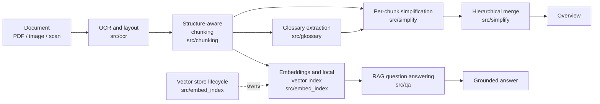

# Qualcomm Offline Doc Simplifier

[](https://www.python.org/downloads/)
[](https://docs.astral.sh/ruff/)
[](docs/TESTING.md)
[](docs/PERFORMANCE.md)
[](https://unstop.com)
[](docs/ROADMAP.md)

**An offline, on-device application that turns dense legal and financial documents into plain-language
explanations — with grounded follow-up Q&A — without ever sending the document off the machine.**

Built for the Snapdragon® AI Lab Build & Present Challenge (Qualcomm) by
**[SaiDhinakar](https://github.com/SaiDhinakar)**.

**Contents:** [Why this exists](#why-this-exists) · [What it does](#what-it-does) ·
[How it works](#how-it-works) · [Quick start](#quick-start) · [Usage](#usage) ·
[On-device validation](#on-device-validation) · [Documentation](#documentation) ·
[Development](#development) · [Contributors](#contributors)

---

## Why this exists

Two problems stack on top of each other:

1. **Document literacy.** Insurance policies, rental agreements, loan paperwork and court notices
   are written in dense, cross-referencing English legalese. For many people in India that is a
   second- or third-language barrier layered on top of a document that already matters a great
   deal — a missed penalty clause or a misunderstood notice period has real consequences.
2. **Privacy.** The obvious workaround — pasting the document into a cloud AI chatbot — means
   uploading financial, legal and personal data to a third-party server. The people most affected
   by problem 1 often have the least reason to accept that trade for problem 2.

Existing tools solve literacy by giving up privacy. This project refuses the trade-off: every
stage (OCR, chunking, simplification, retrieval, Q&A) runs locally on the laptop, with Qualcomm
AI Hub used *ahead of time* to compile, quantize and profile the on-device components against real
Snapdragon hardware.

---

## What it does

Point a camera at a multi-page document (or open a scanned PDF/image) and the pipeline:

1. **Reads it** — layout-aware OCR that keeps headings, numbered clauses, tables and paragraphs
   distinct instead of flattening everything into one text blob, with per-region confidence
   scoring so blurry input is flagged rather than silently mis-explained.
2. **Structures it** — splits at clause/section boundaries (not fixed token windows), preserving
   page number, section ID and document order for every chunk.
3. **Learns its vocabulary** — a glossary pass extracts defined terms ("Insured",
   "Policy Period", "Sum Assured") once, so later stages resolve them instead of re-guessing.
4. **Explains each part** — per-chunk plain-language explanation in the target language, with
   amounts, dates and percentages preserved verbatim from the source.
5. **Summarizes the whole** — a hierarchical merge that surfaces obligations, risks, key dates and
   amounts first, rather than concatenating chunk summaries in document order.
6. **Answers questions** — retrieval-augmented Q&A over a local vector index. If nothing in the
   document matches the question, it says so instead of answering from general knowledge.
7. **Cleans up after itself** — the vector index and chunk text are session-scoped and dropped
   when the view is closed; a visible `clear` command exists for explicit deletion.

A disclaimer is printed with every result: this tool explains documents, it does not provide
legal or financial advice.

---

## How it works



| Stage | Module | Responsibility |
|---|---|---|
| OCR and layout | `src/ocr` | Image/PDF → structured text, regions, confidence scores; Tesseract primary, PaddleOCR fallback |
| Chunking | `src/chunking` | Clause/section-aligned chunks with metadata; sentence-boundary fallback for oversized chunks |
| Glossary | `src/glossary` | One pass over all chunks → defined-term table with source chunk IDs |
| Simplification | `src/simplify` | Glossary-aware plain-language explanation per chunk; numeric fidelity enforced in the prompt |
| Embedding and index | `src/embed_index` | Local embeddings + brute-force cosine search (≈30–50 vectors per document) |
| Merge | `src/simplify` | All chunk explanations → one coherent, prioritized overview |
| Q&A | `src/qa` | Question → top-k retrieval → grounded answer, with a similarity threshold refusal path |
| Lifecycle | `src/embed_index` | Session-scoped store, optional timeouts, explicit clear |
| Orchestration | `src/pipeline` | Sequences both flows and carries OCR reports + compute-unit indication |

Full detail: [`docs/ARCHITECTURE.md`](docs/ARCHITECTURE.md).

---

## Quick start

### Prerequisites

- Python 3.10+
- **Tesseract OCR** (PDFs are rasterized by the bundled PyMuPDF — no Poppler needed)

```bash
# Debian/Ubuntu
sudo apt-get install -y tesseract-ocr tesseract-ocr-eng

# macOS
brew install tesseract
```

### Install

```bash
git clone https://github.com/SaiDhinakar/qualcomm-offline-doc-simplifier.git
cd qualcomm-offline-doc-simplifier

python3.10 -m venv .venv
source .venv/bin/activate
pip install -e ".[embed]"          # adds fastembed embeddings
# optional extras: .[paddle] OCR fallback, .[qai] Qualcomm AI Hub client, .[dev] tooling
```

### Configure backends

```bash
ollama pull qwen2.5:0.5b           # local LLM (https://ollama.com)
export QDS_LLM=ollama QDS_EMBED=fastembed QDS_OCR=auto
```

Stub backends (`QDS_LLM=stub`, `QDS_EMBED=hash`) are the default and are what the test suite runs
on — no model download or server needed to develop.

### First run

```bash
qds analyze /path/to/your/document.pdf --lang en
```

Verified against a one-page insurance-policy sample document:

```text
============================================================
DOCUMENT OVERVIEW
============================================================
The insurance policy is issued by ABC Insurance Company to the Insured named in the
Schedule of this Policy. The Policy Period is the duration of coverage from
January 1, 2025 to December 31, 2025. The Sum Assured is $50,000 ...

Glossary (3 terms)
  Insured: the person named in the Schedule of this Policy
  Policy Period: the duration of coverage from the start date to the end date
  Sum Assured: the maximum amount payable under this Policy

Chunks: 5
```

For question answering in one continuous session, use `qds interactive` (see
[`docs/CLI.md`](docs/CLI.md) for why).

---

## Usage

| Command | Purpose |
|---|---|
| `qds analyze <path> [--lang <code>]` | Analyze a document, print overview + glossary + session ID |
| `qds interactive <path> [--lang <code>]` | Analyze, then loop over follow-up questions in the same session |
| `qds ask <doc-id> "<question>" [--lang <code>]` | Ask one question about an active in-process session |
| `qds clear --all` | Explicitly drop all analyzed documents (visible clear action) |
| `qds info` | Compute units, active sessions, disclaimer |

Output language codes: `hi`, `kn`, `ta`, `te`, `bn`, `mr`, `gu`, `ml`, `pa`, `ur`, `en`
(default `hi`).

Every command prints a compute-unit indicator so on-device execution is visible rather than
merely asserted:

```text
[NPU] Qualcomm Hexagon NPU
```

Complete reference with all options and environment variables: [`docs/CLI.md`](docs/CLI.md).

---

## On-device validation

Hardware claims are checked on real Snapdragon devices through Qualcomm AI Hub cloud device jobs,
not assumed:

| Metric | Result |
|---|---|
| Device | Snapdragon X Elite (SOC SC8380XP), Hexagon HTP, QNN FP16 |
| Execution unit | **NPU** — every node in the profiled graph |
| Steady-state inference | ≈0.16–0.18 ms (median of 100 runs) |
| Cold / warm model load | ≈2.58 s / ≈0.56 s |
| Inference memory increase | ≈3.7 MB |

Raw results are committed at [`data/ai_hub_profile_probe.json`](data/ai_hub_profile_probe.json);
interpretation, method and local end-to-end timings are in
[`docs/PERFORMANCE.md`](docs/PERFORMANCE.md).

---

## Privacy

- No document text, chunk, embedding or answer is transmitted at runtime. Network use is limited
  to build/validation (Qualcomm AI Hub) and one-time model downloads (Ollama/Hugging Face).
- API tokens live in `.env` (git-ignored) or `~/.qai_hub/client.ini`, never in source.
- `data/samples/` is git-ignored: real documents — including your own — are never committed.
- Sessions are in-memory and session-scoped; there is no on-disk persistence of analyzed content.

---

## Documentation

| Document | Contents |
|---|---|
| [`docs/README.md`](docs/README.md) | Documentation index |
| [`docs/PRD.md`](docs/PRD.md) | Problem, goals, functional requirements, success metrics |
| [`docs/ARCHITECTURE.md`](docs/ARCHITECTURE.md) | Design principles, stages, data model, AI Hub strategy |
| [`docs/SETUP.md`](docs/SETUP.md) | Environment setup, backends, troubleshooting |
| [`docs/CLI.md`](docs/CLI.md) | Command reference and session semantics |
| [`docs/TESTING.md`](docs/TESTING.md) | Test suite, golden samples, lint/type-check |
| [`docs/PERFORMANCE.md`](docs/PERFORMANCE.md) | Profiling method, measured results, bottlenecks |
| [`docs/ROADMAP.md`](docs/ROADMAP.md) | Build plan and current status |
| [`docs/CONTRIBUTING.md`](docs/CONTRIBUTING.md) | Development workflow and conventions |

---

## Repository layout

```text
qualcomm-offline-doc-simplifier/
├── src/
│   ├── cli.py             # CLI entry point (qds)
│   ├── models.py          # Shared Pydantic data models
│   ├── disclaimer.py      # In-product non-advice disclaimer
│   ├── ocr/               # Capture, OCR, layout regions, confidence reporting
│   ├── chunking/          # Structure-aware splitting
│   ├── glossary/          # Defined-term extraction
│   ├── simplify/          # LLM backends, per-chunk simplification, merge
│   ├── embed_index/       # Embeddings, local vector index, lifecycle manager
│   ├── qa/                # RAG question answering
│   ├── pipeline/          # End-to-end orchestration
│   └── utils/             # Compute-unit detection (NPU/GPU/CPU)
├── tests/                 # 83 tests + golden-sample fixture
├── docs/                  # Design, setup, CLI, testing, performance, roadmap
├── data/                  # AI Hub profiling results; samples/ (git-ignored)
├── notebooks/             # Exploration notebooks
├── pyproject.toml         # Dependencies, extras, ruff/mypy config
└── requirements.txt       # Flat dependency list (alternative to extras)
```

---

## Development

```bash
source .venv/bin/activate
python -m pytest tests -q          # 82 passed, 1 skipped (real-backend e2e is opt-in)
ruff check src tests               # lint — must be clean
QDS_E2E_REAL=1 python -m pytest tests/test_e2e.py -v   # full e2e with Ollama + fastembed
```

See [`docs/TESTING.md`](docs/TESTING.md) for the test layout and
[`docs/CONTRIBUTING.md`](docs/CONTRIBUTING.md) for workflow and conventions.

---

## Status

Working end-to-end build: OCR → chunking → glossary → simplification → indexing → overview →
RAG Q&A, with an AI Hub-validated NPU profile for a compiled model component. Remaining work
(demo UI pass, recording, submission materials) is tracked in
[`docs/ROADMAP.md`](docs/ROADMAP.md).

---

## Contributors

**[SaiDhinakar](https://github.com/SaiDhinakar)** — author and sole contributor
([@SaiDhinakar](https://github.com/SaiDhinakar)).

Per the challenge rules this is an individual entry: the repository must remain solely owned by
the participant, one submission per participant. Contributions outside this entry are welcome
after the challenge closes — see [`docs/CONTRIBUTING.md`](docs/CONTRIBUTING.md).

---

## Acknowledgements

- Qualcomm AI Hub for cloud-hosted compile/quantize/profile/validation jobs on real Snapdragon
  devices, and for the `qai-hub` client used by the profiling workflow.
- The Snapdragon® AI Lab Build & Present Challenge for framing the evaluation criteria this
  documentation set is written against.
- Upstream projects: Tesseract, PaddleOCR, PyMuPDF, Ollama, fastembed, Click, Pydantic, pytest,
  Ruff.

---

## License

No license has been applied yet — all rights reserved by the author. The challenge submission
guidelines, not an open-source license, currently govern redistribution. An explicit license will
be chosen if this is open-sourced beyond the challenge.
